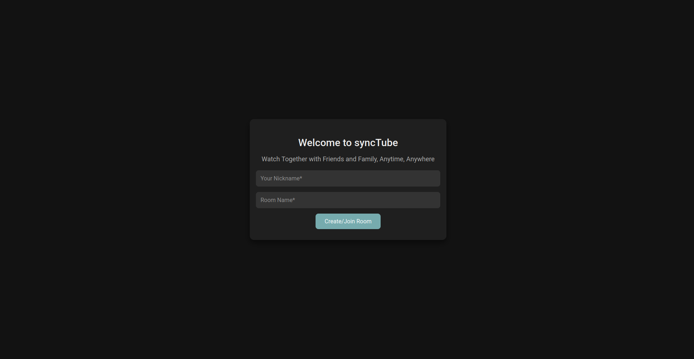
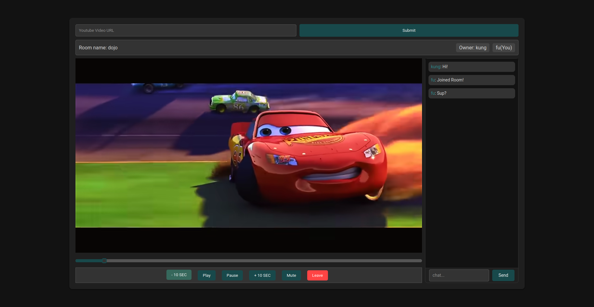

# SyncTube

SyncTube is a web application that allows users to watch YouTube videos together in sync. It is built using React with TypeScript for the frontend and Flask for the backend.

## Features

- Watch Together: Sync YouTube video playback across multiple users.
- Real-time Chat: Chat with other viewers in real-time.

## Technology Used

- Frontend: React with TypeScript
- Backend: Flask
- Styling: CSS Modules
- Real-time Communication: WebSockets using Socket.IO

## Screenshots




## Run Using Docker

### Prerequisites

- Docker
- Docker Compose

### Building and Running the Application

1. Clone this repository:

   ```
    git clone https://github.com/SandroK0/sync-tube.git
    cd sync-tube
   ```

2. Build the Docker containers:

   ```
   docker-compose build
   ```

3. Start the application:

   ```
   docker-compose up
   ```

4. Access the application in your web browser at `http://localhost:3000` (or the appropriate port if you've configured it differently).

To stop the application, press `Ctrl+C` in the terminal where it's running, or run:

```
docker-compose down
```

## Installation (Withour Docker)

Prerequisites

    Node.js
    Python
    npm or yarn
    pip

- Clone the Repository:

bash

    git clone https://github.com/SandroK0/sync-tube.git
    cd sync-tube

### Backend Setup

- Navigate to the backend directory:

bash

    cd backend

- Create a virtual environment:

bash

    python -m venv venv

- Activate the virtual environment:

bash

    source venv/bin/activate

- Install the required packages:

bash

    pip install -r requirements.txt

- Start the Flask server:

bash

    flask run

### Frontend Setup

- Navigate to the frontend directory:

bash

    cd frontend

- Install the required packages:

bash

    npm install

- Start the React development server:

bash

    npm start

Usage

    Ensure the backend server is running.
    Ensure the frontend server is running.
    Open your browser and navigate to http://localhost:3000.
